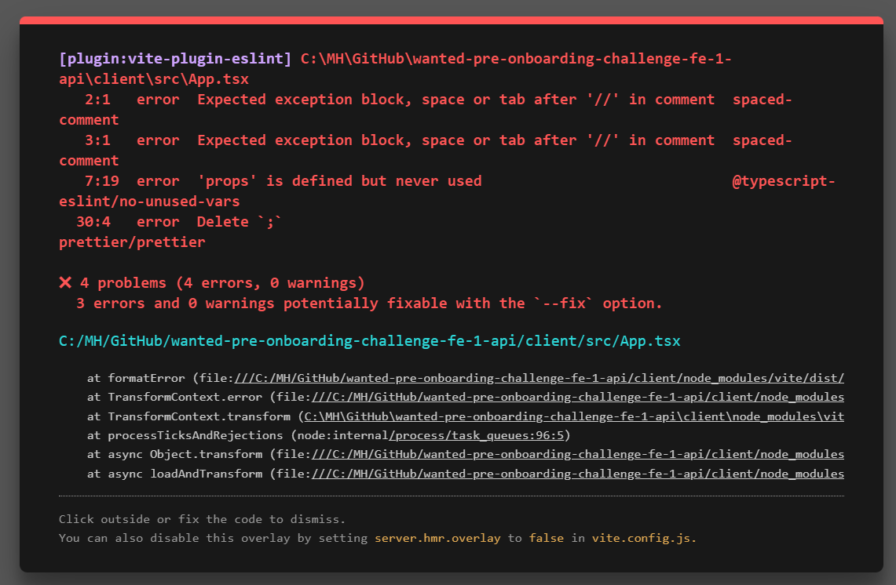

## 연습하면서 생겼던 문제들 끄적이는 곳..

### 깃클론한 리액트 실행
- 클론한다고 바로 실행되는 게 아니라, `npm install` 명령을 해줘야 package-json module이 업데이트된다.
  - server 폴더와 client 폴더의 package-lock.json과 yarn.lock을 삭제
  - 각 폴더에  `npm install`을 실행
  - [참고 링크](https://codemasterkimc.tistory.com/52)

### 할 때마다 까먹는 깃허브랑 연동하기
```
git init
git remote add origin (repo 주소)
git add .
git commit -m "~~"
git push origin master
```

### 깃모지를 사용해보자
- 깃모지 설치는 `npm i -g gitmoji-cli`
- 깃모지 설명은 `gitmoji --help`
- `git commit -m` 대신에 `gitmoji -c`로 커밋 작성하기
- 약속된 깃모지 내용은 [여기](https://inpa.tistory.com/entry/GIT-%E2%9A%A1%EF%B8%8F-Gitmoji-%EC%82%AC%EC%9A%A9%EB%B2%95-Gitmoji-cli) 참고하기
- 깃모지에 맞는 커밋이 되어야 하므로 커밋을 조금 세분화해서 하기!!


### 의문1

- 왜 주석도 에러로 뜨지?
- 왜 props 사용 안했다고 난리지..
- 원래 이렇게 해야하는건가?

### 의문2
- h1, h2, input 같은 태그들의 기본 스타일(?)이 반영이 안된다. 왜지? 
